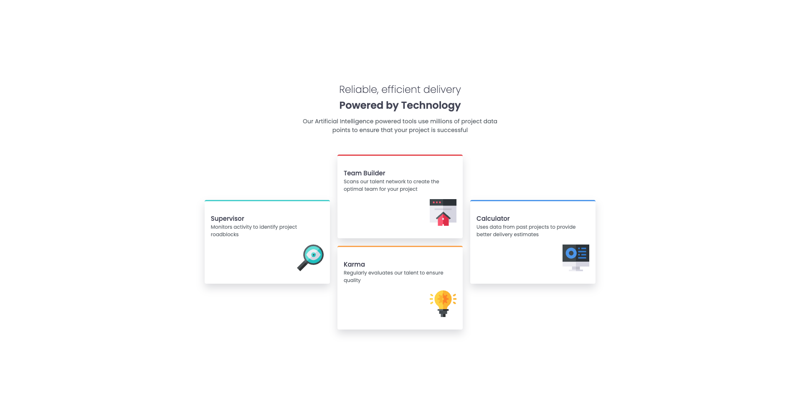

# Frontend Mentor - Four card feature section solution

This is a solution to the [Four card feature section challenge on Frontend Mentor](https://www.frontendmentor.io/challenges/four-card-feature-section-weK1eFYK). Frontend Mentor challenges help you improve your coding skills by building realistic projects.

## Table of contents

- [Overview](#overview)
  - [The challenge](#the-challenge)
  - [Screenshot](#screenshot)
  - [Links](#links)
- [My process](#my-process)
  - [Built with](#built-with)
  - [What I learned](#what-i-learned)
- [Author](#author)

## Overview

### The challenge

Users should be able to:

- View the optimal layout for the site depending on their device's screen size

### Screenshot



### Links

- Solution URL: [Add solution URL here](https://your-solution-url.com)
- Live Site URL: [Add live site URL here](https://your-live-site-url.com)

## My process

### Built with

- Semantic HTML5 markup
- BEM methodology
- CSS SASS
- Flexbox
- CSS Grid
- Desktop-first workflow

### What I learned

More understandind of Grid layout, how to align grid tracks in Grid container.

```css
.element {
  display: grid;
  grid-template-columns: repeat(3, 25%);
  grid-template-rows: repeat(2, 1fr);
  align-items: center;
  justify-content: center;
}
```

## Author

- Frontend Mentor - [@Adair Costa](https://www.frontendmentor.io/profile/Adair-Costa)
